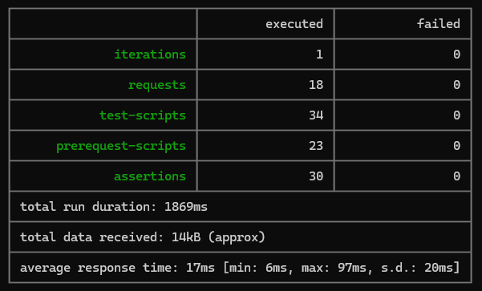

# Postman tests

Here there are some _Postman_'s requests to validating backend.
We can run by Postman or using CLI by Newman.

## How to execute

### Postman
On Postman you can just import the collection, and run it.

### Newman
Using CLI, you can install Newman and run it by script.

#### Installing Newman

- `npm i -g newman`

#### Running collection by Newman

- `newman run <path>/collectionName.json`

